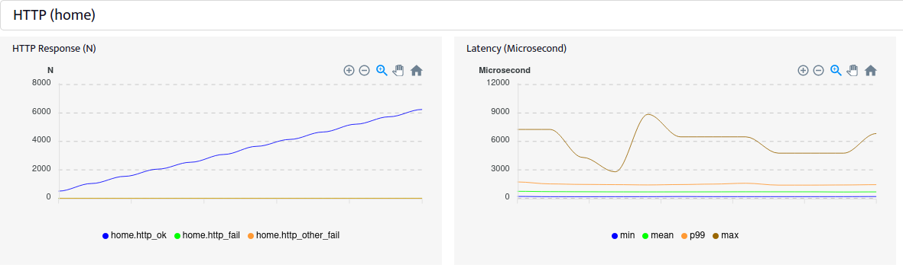

## 

A benchmark framework with Golang.

> Note: Gobench is under heavy development.

Targets:

1. Supporting more than HTTP. We are having MQTT, NATs. Websocket, graphQL will
   be added.
2. Having complicated benchmarking scenario in Golang. Yo no DSL, and Golang
   is easy to pickup.
3. (WIP) To support more than one million connection concurrently.

[](https://github.com/gobench-io/gobench/actions)


[](https://codecov.io/gh/gobench-io/gobench)

## Usage

### Install from source

Requirements:

- golang to compile your scenario
- gcc to build sqlite3 embedded database

Install the command line tool first

```
go get github.com/gobench-io/gobench
```

This mechanism will install a build of master at $GOPATH/bin. To test your
installation:

```{shell}
$ gobench
{"level":"info","ts":1601432777.7513623,"caller":"master/master.go:71","msg":"new master program","port":8080,"home directory":"/home/nqd/.gobench"}
{"level":"info","ts":1601432777.9341393,"caller":"web/web.go:161","msg":"web server start","port":":8080"}
```

After that, open http://localhost:8080 to see the dashboard.

### Run from docker

```
docker run -p 8080:8080 nqdinh/gobench:latest
```

After that, open http://localhost:8080 to see the dashboard.

## Quick start

Start the Gobench server, go to http://localhost:8080 dashboard, create new
application.

Input scenario as the following go code. gomod and gosum are used to control
specific version of dependency packages. We will leave them empty now.

```{go}
// Test a server running on a local machine on port 8080.
// Send 10 requests per second for 2 minute from 5 nodes in parallel,
// which totals up to 50 requests per second altogether.

package main

import (
    "context"
    "log"
    "time"

    httpClient "github.com/gobench-io/gobench/clients/http"
    "github.com/gobench-io/gobench/dis"
    "github.com/gobench-io/gobench/executor/scenario"
)

func export() scenario.Vus {
    return scenario.Vus{
        {
            Nu:   5,
            Rate: 1000,
            Fu:   f,
        },
    }
}

func f(ctx context.Context, vui int) {
    client, err := httpClient.NewHttpClient(ctx, "home")
    if err != nil {
        log.Println("create new client fail: " + err.Error())
        return
    }

    url1 := "http://localhost:8080"

    timeout := time.After(2 * time.Minute)

    for {
        select {
        case <-timeout:
            return
        default:
            go client.Get(ctx, url1, nil)
            dis.SleepRatePoisson(10)
        }
    }
}
```

From the dashboard, you will see the live result:



You also see the status of the host running Gobench: Load average, CPU
utilization, RAM usage, network in/out.

## How to write scenario

Scenario is a go file that must have a `func export() scenario.Vus {...}` function.
This function return an array of `scenario.Vu` struct. 

Each `scenario.Vu` defines behavior of a type of virtual user (vu). In previous
example, the vu is defines as

```{golang}
{
    Nu:   5,
    Rate: 1000,
    Fu:   f,
}
```
, on which:
- `Nu` defines the number of virtual users for this type of user
- `Rate` is the startup rate for all virtual users with Poisson distribution. In
  this case 1000 virtual users are created in one second.
- `Fu` defines the behavior of a virtual user. Fu must be define as `func f(ctx
  context.Context, vui int) {...}`.


When your benchmark scenario is more complecated, you can define multiple
virtual user types

```{golang}

func export() scenario.Vus {
    return scenario.Vus{
        {
            Nu:   5,
            Rate: 1000,
            Fu:   adminF,
        },
        {
            Nu:   7,
            Rate: 1000,
            Fu:   userF,
        },
    }
}
```

## How to write a new worker

Gobench is supporting 3 clients: HTTP, MQTT, NATs. Creating a new type of worker
for Gobench is very simple. The worker has to have the following properties.

### Expose the metrics

Exposes to gobench via `executor.Setup(groups)` calling where groups is
`[]metrics.Group{}` structure.

For convenience, one should call the metrics setup at the end of constructor
like `NewHttpClient` on which calling `executor.Setup`.

Gobench strictly force you to create the metrics hierarchy. Group name
(Group.Name) must be unique globally. Also metric title (Metric.Title) must be
unique globally.

Gobench is supporting 3 kinds of metric: counter, histogram, and gauge.

### Notify the metric

Notify to gobench via `executor.Notify(metric name, value)`.

See `clients/http` for HTTP worker example.

## Benchmark the benchmark

Right, the benchmark tool should show the ability to generate a good amount of
traffic given RAM, CPU resources. For HTTP, we compare Gobench with `k6`
(v0.29.0), `hey` (v0.1.4), `Artillery` (v1.6.1), `Jmeter` (v5.2.1). For MQTT, we
compare Gobench with `eqmtt_bench`.

We benchmark the benchmarks with two c5.4xlarge (16 core CPU, 32 GB RAM) VM. For
HTTP case, the server is the high speed Nginx. Each client gets the main Nginx
page with `vu` = 30 during 120 seconds.

| HTTP client  | CPU (%) | RAM (MB) | RPS   |
|--------------|---------|----------|-------|
| hey          | 218     | 150       | 27220 |
| k6           | 342    | 556.3     | 26314 |
| Jmeter       | 199    | 814.6     | 26259 |
| Gobench      | 281    | 114.5     | 25686 |
| Artillery    | 107    | 145.3     | 1197  |

For MQTT case, the server is Vernemq. Each client run two scenarios: (1) Just
create `n` clients that to Vernemq with 10 seconds heartbeat, and (2) create `n`
clients, each publishes 1 message per second to topic `bench/$i` where `i` is
the client id. We choose n = 250, 11250, 25000.

| MQTT client  | CPU (%) | RAM (MB) |
|--------------|---------|----------|
| Gobench 250 conn      | 12 | 225 |
| Gobench 11250 conn    | 31 | 536.5 |
| Gobench 25000 conn    | 52 | 1024 |
| emqtt_bench 250 conn   | 12 | 147 |
| emqtt_bench 11250 conn | 37| 643 |
| emqtt_bench 25000 conn | 49 | 1485 |
| Gobench 250 pub       | 85    | 267.3 |
| Gobench 11250 pub     | 286   | 741.9 |
| Gobench 25000 pub     | 669   | 1450.0 |
| emqtt_bench 250 pub   | 52 | 252 |
| emqtt_bench 11250 pub | 297| 995 |
| emqtt_bench 25000 pub | 850 | 2847 |

## Sponsor

<a href="http://veriksystems.com"></a>
