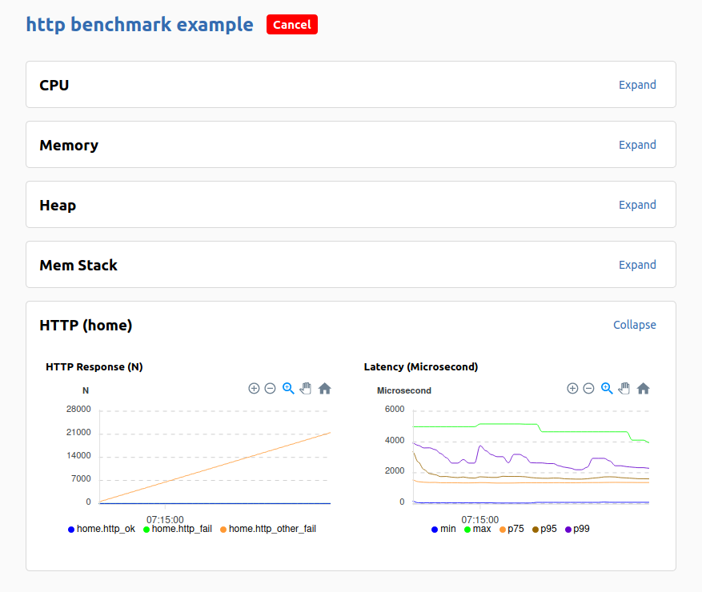

# Gobench

A distributed benchmark tool with Golang

> Note: gobench is under heavy development. Do not use.

## Why gobench

Targets: Supporting more than HTTP like MQTT, Websocket, graphQL. It can scale to support up to 1 million connection concurrently. It could support scriptable tool.

## Workers

Supported workers: MQTT, NATs, HTTP

Please see the following section for creating a new type of worker.

## Web API

Get histogram metric:

http://localhost:1234/api/metrics/55/histograms

Get histogram metric from a timestamp (ms)

http://localhost:1234/api/metrics/55/histograms?from=1586320159476&end=1586320169476

## Tool gobench-reviewer

## How to write a new worker

Creating a new type of worker for gobench is very simple. The worker has to have the following properties.

### Expose the metrics

Exposes to gobench via `gobench.Setup(groups)` calling where groups is `[]metrics.Group{}` structure.

For convenience, one should call the metrics setup at the end of constructor like `NewHttpClient` on which calling `gobench.Setup`.

Gobench strictly force you to create the metrics hierarchy. Group name (Group.Name) must be unique globally. Also metric title (Metric.Title) must be unique globally.

Gobench is supporting 3 kinds of metric: counter, histogram, and gauge.

### Notify the metric

Notify to gobench via `gobench.Notify(metric name, value)`.

See `clients/http` for HTTP worker example.

## Sponsor

